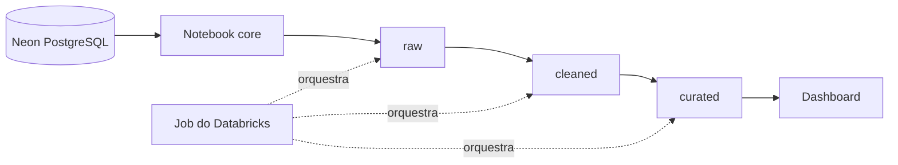

<div align="center">

# ☀️ Apollo BI

### Inteligência de dados para a gestão do ciclo de vida de painéis solares

Pipeline de dados em arquitetura medalhão no **Databricks**, alimentado pelo banco
do ecossistema **Apollo** no Neon, que gera a base tratada, os KPIs e o dashboard
gerencial do projeto.

[](https://www.databricks.com/)
[](https://spark.apache.org/docs/latest/api/python/)
[](https://neon.tech/)
[](https://delta.io/)
[](https://docs.databricks.com/aws/en/repos/)

</div>

---

## Sobre o projeto

O **Apollo BI** é a entrega de Business Intelligence do Projeto Interdisciplinar
Apollo. A solução transforma os dados gerados pela aplicação (lotes, painéis,
unidades, manutenções e demais entidades) em informação organizada para apoiar a
decisão de gerentes e analistas das filiais.

Nesta etapa, o repositório entrega a estrutura do pipeline, a conexão com a fonte
de dados e as três camadas de tratamento. O cálculo dos KPIs e o dashboard são os
próximos passos.

## Funcionalidades previstas

- Conexão com o Neon por JDBC, com credenciais guardadas em Databricks Secrets;
- Ingestão das tabelas do banco sem alteração na camada `raw`;
- Limpeza e padronização dos dados na camada `cleaned`;
- Cálculo dos KPIs e dos índices de sustentabilidade (IS Financeiro, Ambiental e Energético) na camada `curated`;
- Dashboard conectado à base final, com filtros por período e filial;
- Job no Databricks para executar o pipeline sem rodar célula por célula;
- Relatório gerencial explicando a base, o problema, o tratamento e os KPIs.

## Arquitetura

O fluxo segue a arquitetura medalhão, com nomes descritivos para cada camada:



| Camada | Equivalente medalhão | O que contém |
|---|---|---|
| `raw` | Bronze | Cópia fiel das tabelas do Neon, com data e origem da ingestão |
| `cleaned` | Silver | Nomes padronizados, textos sem espaços extras, sem duplicatas exatas |
| `curated` | Gold | KPIs e índices calculados, prontos para o dashboard |

```text
apollo-bi/
├── apollo_core/
│   └── apollo_connection_neon_core    # Conexão com o Neon e funções reutilizáveis
├── apollo_pipeline/
│   ├── raw_ingest                     # Neon para a camada raw
│   ├── cleaned_transform              # raw para a camada cleaned
│   └── curated_kpis                   # cleaned para a camada curated
├── apollo_manager/                    # Dashboard principal (a criar)
└── README.md
```

As tabelas são salvas como `workspace.raw`, `workspace.cleaned` e
`workspace.curated`. O catálogo pode ser ajustado na variável `CATALOG` do
notebook core.

## Tecnologias

| Tecnologia | Uso no projeto |
|---|---|
| Databricks | Execução dos notebooks, Jobs e dashboard |
| PySpark | Leitura, tratamento e transformação dos dados |
| Delta Lake | Armazenamento das tabelas de cada camada |
| Neon (PostgreSQL) | Fonte de dados operacional do Apollo |
| JDBC | Conexão entre Databricks e Neon |
| Databricks Secrets | Guarda segura das credenciais |
| GitHub | Versionamento e revisão do código |

## Como executar

### Pré-requisitos

- Acesso ao workspace do Databricks do Apollo;
- Conta no GitHub com permissão de escrita neste repositório;
- Personal Access Token do GitHub com escopo `repo`.

> Não é preciso instalar nada na máquina. Todo o processamento roda no Databricks.

### 1. Conecte o GitHub ao Databricks

No Databricks, acesse **Settings > Linked accounts > Git integration**, escolha
GitHub e informe o seu Personal Access Token.

### 2. Crie a Git folder

Em **Workspace > Create > Git folder**, cole a URL do repositório e confirme:

```text
https://github.com/<ORGANIZACAO>/<REPOSITORIO>.git
```

Depois, troque para a sua branch no menu de branches, no topo da pasta.

### 3. Configure as credenciais do Neon

Esta etapa é feita **uma única vez, pelo dono do workspace**. Crie o escopo
`apollo` com as quatro chaves abaixo usando o Databricks CLI:

```bash
databricks secrets create-scope apollo
databricks secrets put-secret apollo neon_host
databricks secrets put-secret apollo neon_db
databricks secrets put-secret apollo neon_user
databricks secrets put-secret apollo neon_password
```

| Secret | Descrição |
|---|---|
| `neon_host` | Host do Neon, sem `https://` |
| `neon_db` | Nome do banco |
| `neon_user` | Usuário do banco |
| `neon_password` | Senha do banco |

Os valores vêm da connection string do projeto no painel do Neon.

> Nunca escreva credenciais em notebooks, commits ou mensagens do grupo.

### 4. Teste a conexão

Abra `apollo_core/apollo_connection_neon_core` e use **Run all**. O resultado
esperado é a lista de tabelas do Neon impressa na última célula.

### 5. Execute o pipeline

Rode os notebooks de `apollo_pipeline` nesta ordem:

1. `raw_ingest`
2. `cleaned_transform`
3. `curated_kpis`

## Configuração do notebook core

| Variável | Padrão | Descrição |
|---|---|---|
| `CATALOG` | `workspace` | Catálogo onde as camadas são criadas |
| `NEON_SCHEMA` | `public` | Schema de origem no Neon (ajustar se o BI ler outro, como o data mart) |
| `SECRET_SCOPE` | `apollo` | Escopo dos secrets no Databricks |

## Requisitos da disciplina: Business Intelligence

Esta seção relaciona a implementação aos critérios definidos para a disciplina em
maio de 2026.

| Requisito | Situação | Evidência no projeto |
|---|:---:|---|
| Dashboard conectado à fonte de dados da aplicação | ⏳ | Será construído sobre a camada `curated` |
| Gráficos de barra e linha | ⏳ | Planejado no dashboard |
| Cards de KPIs e desvios | ⏳ | Planejado no dashboard |
| Histogramas e boxplots | ⏳ | Planejado no dashboard |
| Mapa, se houver dados geográficos | ⏳ | A avaliar conforme os dados de localização das placas |
| Filtros interativos (período, filial) | ⏳ | Planejado no dashboard |
| Relatório gerencial | ⏳ | Apresentação da base, problema, tratamento e KPIs |
| Pipeline no Databricks (leitura, tratamento, KPIs, base final) | 🚧 | Estrutura criada em `apollo_pipeline`; KPIs ainda por implementar |
| Pipeline usando a fonte gerada pela aplicação | 🚧 | Notebook core criado; falta validar com o schema definitivo |
| Job para executar o pipeline sem rodar célula por célula | ⏳ | Planejado |
| Evidências do Job (configuração, histórico, status, resultado) | ⏳ | Planejado |

**Legenda:** ✅ concluído · 🚧 em desenvolvimento · ⏳ planejado

## Próximos passos

- Validar o schema de origem no Neon e ajustar `NEON_SCHEMA`;
- executar o `raw_ingest` e conferir as tabelas geradas;
- implementar os KPIs e os índices na camada `curated`;
- criar o Job com as três etapas em sequência;
- construir o dashboard a partir da base `curated`;
- adicionar a restrição de acesso por filial (Row Filter) quando os dashboards estiverem finalizados;
- escrever o relatório gerencial com o fluxo do pipeline e a relação com os KPIs.

## Contribuição

Regras para todo o grupo:

1. **Nunca edite na `main`.** Cada pessoa trabalha em uma branch própria;
2. antes de começar, faça **Pull** da `main` e crie a sua branch: `feat/<seu-nome>-<assunto>`;
3. avise o grupo qual notebook você vai editar, para evitar conflito de merge;
4. faça commits curtos e claros, seguindo o padrão
   [Conventional Commits](https://www.conventionalcommits.org/pt-br/v1.0.0/);
5. envie a branch (**Push**) e abra um **Pull Request** descrevendo a alteração;
6. outra pessoa do grupo revisa e faz o merge na `main`.

Fluxo do dia a dia:

1. Abra a sua Git folder e faça **Pull**;
2. confirme que está na sua branch;
3. edite apenas o notebook combinado e rode para testar;
4. faça **Commit & Push** e abra o Pull Request.

Os notebooks são versionados em formato `.py`, o que mantém o diff legível no GitHub.

---

<div align="center">

Desenvolvido pela equipe **Apollo** para o Projeto Interdisciplinar 2026. 🚀

</div>
