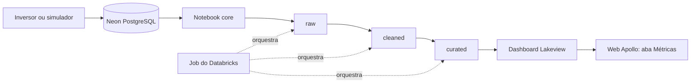

<div align="center">

# ☀️ Apollo BI

### Métricas de saúde e sustentabilidade dos ativos solares do Apollo

Pipeline de dados em arquitetura medalhão no **Databricks**, que lê o banco do
Apollo no Neon, calcula os índices de sustentabilidade (IS) e alimenta o dashboard
embutido na web.

[](https://www.databricks.com/)
[](https://spark.apache.org/docs/latest/api/python/)
[](https://neon.tech/)
[](https://delta.io/)
[](https://docs.databricks.com/aws/en/repos/)

</div>

---

## Sobre o projeto

O **Apollo** é uma plataforma SaaS multi-tenant para gestão do ciclo de vida de
ativos fotovoltaicos em empresas industriais. O inversor mede o desempenho de cada
string, e o Apollo usa esse dado real para gerar alertas, ordens de serviço e
realocações de placas.

O **Apollo BI** é a camada de análise dessa plataforma. Ele lê o banco do Apollo
no Neon, trata os dados em três camadas e calcula os índices que aparecem na aba
**Métricas** da web. O **Gerente** e o **Analista** acessam o dashboard e veem
apenas a própria filial.

> A unidade monitorada no Apollo é a **string**. A hierarquia dos ativos é:
> empresa, filial, inversor, string e placa.

## Dados de origem

A fonte é o banco do Apollo no Neon (PostgreSQL, 24 tabelas). Os grupos de tabelas
mais relevantes para o BI são:

| Grupo | Tabelas |
|---|---|
| Organização | `company`, `company_unit`, `address`, `segment`, `employee`, `administrator` |
| Ativos | `inverter`, `string`, `panel`, `inverter_model`, `panel_model` |
| Medição e saúde | `string_performance_measurement`, `string_health_history` |
| Alertas e manutenção | `warning`, `maintenance_register`, `maintenance_part`, `maintenance_type`, `part`, `stock` |
| Histórico | `panel_status_history`, `access_log` |

As medições por string (`power_w`, `voltage_v`, `current_a`, `generated_energy_kwh`,
`fault_code`) vêm do inversor. Na demonstração, elas são geradas por um simulador, e
a coluna `data_source` registra a origem de cada leitura.

## Índices de sustentabilidade (IS)

| Índice | O que mede |
|---|---|
| **IS Ambiental** | Vida útil do painel |
| **IS Financeiro** | Custo do painel comparado ao que seria pago de energia sem o sistema |
| **IS Energético** | Queda brusca na captação e desempenho abaixo do padrão da etiqueta do equipamento |
| **IS Geral** | Combinação dos três índices, por filial |

Regras de cálculo definidas pelo grupo:

- Tudo o que não existir no banco atual fica de fora do cálculo. O schema não será alterado para isso;
- cada IS é calculado por string (ou inversor) e depois agregado por filial;
- não existe tabela por painel na camada final.

## Funcionalidades previstas

- Conexão com o Neon por JDBC, com credenciais em Databricks Secrets;
- ingestão das tabelas do banco sem alteração na camada `raw`;
- limpeza e padronização na camada `cleaned`;
- cálculo dos quatro índices na camada `curated`;
- dashboard (Lakeview) embutido na aba Métricas da web;
- acesso restrito por filial (Row Filter) para Gerente e Analista;
- Job no Databricks para executar o pipeline sem rodar célula por célula;
- relatório gerencial com o fluxo do pipeline e a relação com os KPIs.

## Arquitetura

O fluxo segue a arquitetura medalhão, com nomes descritivos para cada camada:



| Camada | Equivalente medalhão | O que contém |
|---|---|---|
| `raw` | Bronze | Cópia fiel das tabelas do Neon, com data e origem da ingestão |
| `cleaned` | Silver | Nomes padronizados, textos sem espaços extras, sem duplicatas exatas |
| `curated` | Gold | Índices calculados por string e por filial, prontos para o dashboard |

```text
apollo-bi/
├── apollo_core/
│   └── apollo_connection_neon_core    # Conexão com o Neon e funções reutilizáveis
├── apollo_pipeline/
│   ├── raw_ingest                     # Neon para a camada raw
│   ├── cleaned_transform              # raw para a camada cleaned
│   └── curated_kpis                   # cleaned para a camada curated (cálculo dos IS)
├── apollo_manager/                    # Dashboard principal (a criar)
└── README.md
```

As tabelas são salvas como `workspace.raw`, `workspace.cleaned` e
`workspace.curated`. O catálogo e o schema de origem ficam nas variáveis do
notebook core.

## Tecnologias

| Tecnologia | Uso no projeto |
|---|---|
| Databricks | Execução dos notebooks, Jobs e dashboard Lakeview |
| PySpark | Leitura, tratamento e transformação dos dados |
| Delta Lake | Armazenamento das tabelas de cada camada |
| Neon (PostgreSQL) | Banco operacional do Apollo, fonte do BI |
| JDBC | Conexão entre Databricks e Neon |
| Databricks Secrets | Guarda segura das credenciais |
| React | Web do Apollo, onde o dashboard é embutido |
| GitHub | Versionamento e revisão do código |

## Como executar

### Pré-requisitos

- Acesso ao workspace do Databricks do Apollo;
- Conta no GitHub com permissão de escrita neste repositório;
- Personal Access Token do GitHub com escopo `repo`.

> Não é preciso instalar nada na máquina. Todo o processamento roda no Databricks.

### 1. Conecte o GitHub ao Databricks

No Databricks, acesse **Settings > Linked accounts > Git integration**, escolha
GitHub e informe o seu Personal Access Token.

### 2. Crie a Git folder

Em **Workspace > Create > Git folder**, cole a URL do repositório e confirme:

```text
https://github.com/<ORGANIZACAO>/<REPOSITORIO>.git
```

Depois, troque para a sua branch no menu de branches, no topo da pasta.

### 3. Configure as credenciais do Neon

Esta etapa é feita **uma única vez, pelo dono do workspace**. Crie o escopo
`apollo` com as quatro chaves abaixo usando o Databricks CLI:

```bash
databricks secrets create-scope apollo
databricks secrets put-secret apollo neon_host
databricks secrets put-secret apollo neon_db
databricks secrets put-secret apollo neon_user
databricks secrets put-secret apollo neon_password
```

| Secret | Descrição |
|---|---|
| `neon_host` | Host do Neon, sem `https://` |
| `neon_db` | Nome do banco |
| `neon_user` | Usuário do banco |
| `neon_password` | Senha do banco |

Os valores vêm da connection string do projeto no painel do Neon.

> Nunca escreva credenciais em notebooks, commits ou mensagens do grupo.

### 4. Teste a conexão

Abra `apollo_core/apollo_connection_neon_core` e use **Run all**. O resultado
esperado é a lista de tabelas do Neon impressa na última célula.

### 5. Execute o pipeline

Rode os notebooks de `apollo_pipeline` nesta ordem:

1. `raw_ingest`
2. `cleaned_transform`
3. `curated_kpis`

## Configuração do notebook core

| Variável | Padrão | Descrição |
|---|---|---|
| `CATALOG` | `workspace` | Catálogo onde as camadas são criadas |
| `NEON_SCHEMA` | `public` | Schema de origem no Neon (ajustar para o schema que o BI lê) |
| `SECRET_SCOPE` | `apollo` | Escopo dos secrets no Databricks |

## Requisitos da disciplina: Business Intelligence

Esta seção relaciona a implementação aos critérios definidos para a disciplina em
maio de 2026.

| Requisito | Situação | Evidência no projeto |
|---|:---:|---|
| Dashboard conectado à fonte de dados da aplicação | ⏳ | Será construído sobre a camada `curated` |
| Gráficos de barra e linha | ⏳ | Evolução e comparação dos IS por filial e período |
| Cards de KPIs e desvios | ⏳ | Um card por IS e para o IS Geral |
| Histogramas e boxplots | ⏳ | Distribuição dos IS e da saúde das strings |
| Mapa, se houver dados geográficos | ⏳ | A confirmar se `address` traz coordenadas das filiais |
| Filtros interativos (período, filial) | ⏳ | Planejado no dashboard |
| Relatório gerencial | ⏳ | Apresentação da base, problema, tratamento e KPIs |
| Pipeline no Databricks (leitura, tratamento, KPIs, base final) | 🚧 | Estrutura criada em `apollo_pipeline`; cálculo dos IS ainda por implementar |
| Pipeline usando a fonte gerada pela aplicação | 🚧 | Notebook core criado; falta validar com o schema definitivo do Neon |
| Job para executar o pipeline sem rodar célula por célula | ⏳ | Planejado |
| Evidências do Job (configuração, histórico, status, resultado) | ⏳ | Planejado |

**Legenda:** ✅ concluído · 🚧 em desenvolvimento · ⏳ planejado

## Próximos passos

- Confirmar o schema de origem no Neon e ajustar `NEON_SCHEMA`;
- executar o `raw_ingest` e conferir as tabelas geradas;
- mapear quais colunas do banco alimentam cada IS e implementar o cálculo na camada `curated`;
- criar o Job com as três etapas em sequência;
- construir o dashboard a partir da base `curated`;
- adicionar o Row Filter por filial quando os dashboards estiverem finalizados;
- deixar o React pronto para receber o embed e ativar o trial de 14 dias do Databricks de 4 a 5 dias antes da apresentação;
- escrever o relatório gerencial com o fluxo do pipeline e a relação com os KPIs.

## Contribuição

Regras para todo o grupo:

1. **Nunca edite na `main`.** Cada pessoa trabalha em uma branch própria;
2. antes de começar, faça **Pull** da `main` e crie a sua branch: `feat/<seu-nome>-<assunto>`;
3. avise o grupo qual notebook você vai editar, para evitar conflito de merge;
4. faça commits curtos e claros, seguindo o padrão
   [Conventional Commits](https://www.conventionalcommits.org/pt-br/v1.0.0/);
5. envie a branch (**Push**) e abra um **Pull Request** descrevendo a alteração;
6. outra pessoa do grupo revisa e faz o merge na `main`.

Fluxo do dia a dia:

1. Abra a sua Git folder e faça **Pull**;
2. confirme que está na sua branch;
3. edite apenas o notebook combinado e rode para testar;
4. faça **Commit & Push** e abra o Pull Request.

Os notebooks são versionados em formato `.py`, o que mantém o diff legível no GitHub.

---

<div align="center">

Desenvolvido pela equipe **Apollo** para o Projeto Interdisciplinar 2026. 🚀

</div>
